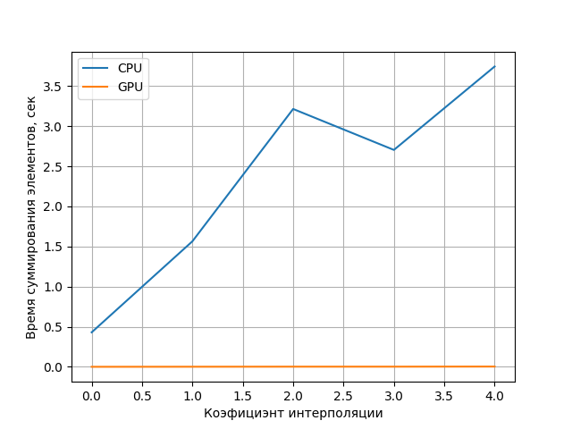

# Лабораторная работа №2
Сделал в [Colab](./bilinear.ipynb). 

Тестирую работу алгоритма на следующем изображении:

Для ускорения его работы порядочно сжал его:

Результат интерполяции:

Вот график сравнения работы алгоритма на CPU и GPU. Хотя я провел всего 5 итераций, сам график более чем репрезентативный:

