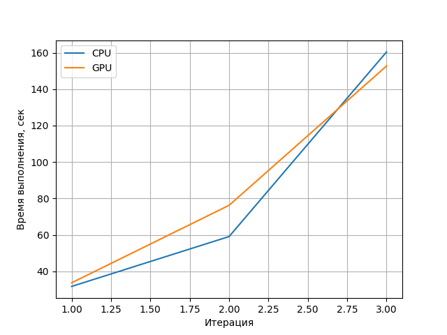

# Лабораторная работа №3

Сделал в [Colab](./harris.ipynb).
Тестирую работу алгоритма на картинках различного разрешения (лежат [здесь](./images)) 
Всего было 3 итерации с возрастающим разрешеним изображения:

- (900, 1200)
- (1742, 1125)
- (1920, 2560)

Получившийся график:

Ввиду характера самих изображений, CPU немного опрережал по времени выполнения GPU, однако с увеличением разрешения алгоритм на GPU начинает работать быстрее.