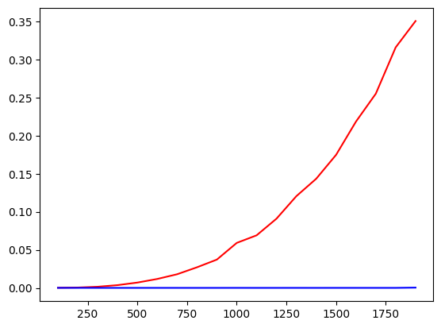

# Лабораторная работа №0
Я изначально сделать лабораторную на ROCm, но у меня возникла проблема с тем, что он не очень хорошо поддерживает windows, поэтому делал в Colab на Python, использовал pytorch. Исходные матрицы генерировал случайно размеров от 100х100 до 2000х2000 с шагом 100.

Вот график оценки перемножения матриц с использованием CPU (красный цвет) и GPU CUDA (синий цвет):

На графике ось абсцисс - размерности матриц, ординат - время в секундах. 