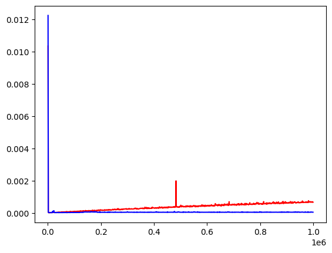

# Лабораторная работа №1
Так же делал в [Colab](./vector_sum.ipynb). В этот раз попытался реализовать свою функцию для сложения элементов векторов, но питон считал неадекватно долго (два часа и в итоге я не дождался). Для сложения воспользовался библиотечной функцией.

Вот график оценки сложения элементов с использованием CPU (красный цвет) и GPU CUDA (синий цвет):

Полагаю, задержка GPU вначале свзана со временем подключения ее ресурсов в Collab.